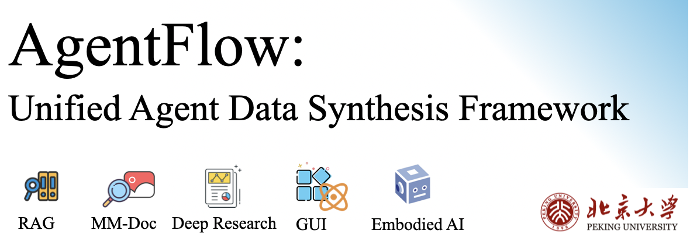

<div align="center">
  

[](https://huggingface.co/collections/OpenDCAI/agentflow-models)
[](https://huggingface.co/collections/OpenDCAI/agentflow-models)
[](https://github.com/OpenDCAI/AgentFlow)
[](https://opendcai.github.io/AgentFlow-Doc/en/)
 </div>


**The First Unified Agent Data Synthesis Framework** for Custom Task with all-in-one envrionment.

## 🚀 Overview

**AgentFlow** is the **first unified, large-scale agent data synthesis framework** that systematically generates high-quality training and evaluation data—whether within a **single specialized environment** or across **heterogeneous agent environments**—spanning 📚 RAG (Retrieval-Augmented Generation), 🖼️ MM-Doc (Multi-Modal Document Understanding), 🔍 Deep Research Agents, 🖱️ GUI / Tool-Using Agents, 📊 Data Analysis Agents, and 🤖 Embodied Agents and more.

Unlike prior task-specific or single-environment solutions, AgentFlow provides a **unified, all-in-one envrionment**—general, extensible, and scalable—for synthesizing agent trajectories, reasoning traces, tool interactions, and environment feedback.

By constructing diverse, realistic environments that mirror real-world deployment scenarios, AgentFlow enables the training of **industrial-grade agentic foundation models**—capable of operating seamlessly across multiple domains through data-level or parameter-level agent consolidation.

> **One framework. All agent worlds.**

## ✨ Key Features

### 🧠 Unified Agent Data Synthesis Paradigm

AgentFlow provides a **unified abstraction layer** that enables seamless data synthesis across heterogeneous agent environments — all through a single, consistent interface.

**Supported Environments:**
- 📚 **RAG** — Retrieval-Augmented Generation with multi-hop reasoning
- 🖼️ **MM-Doc** — Multi-modal document understanding and visual QA
- 🔍 **Deep Research** — Web-scale information gathering and synthesis
- 💻 **Code** — Programming tasks with execution feedback
- 🖱️ **GUI** — Desktop and web UI interaction
- 🤖 **Embodied** — Physical world simulation and navigation

**Key Benefits:**
- **Write once, synthesize everywhere** — Define your synthesis logic once and apply it without rewriting pipelines
- **Environment-agnostic tooling** — Shared utilities for task generation, trajectory recording, and quality control
- **Seamless scaling** — Generate millions of diverse trajectories across domains with a single coordinated workflow

This unified approach eliminates the traditional barrier of maintaining separate, incompatible data pipelines for each agent domain, enabling foundation model labs to efficiently train **generalist agentic models** at scale.

### Exploring Agent Consolidation: From Specialists to Generalists

As agents become specialized for distinct environments, a critical challenge arises: **How to consolidate heterogeneous capabilities into a single foundation agentic model?** We systematically investigate two primary strategies:

- **Data-level Consolidation:** Jointly training a unified model on a mixture of trajectories from all domains. It serves as a strong, stable baseline but faces high re-training costs.
- **Parameter-level Consolidation:** Merging independently trained expert models in parameter space. It is computationally efficient but requires careful design to mitigate task interference.


## 🛠️ QueckStart
### Lauching Sandbox
```python
import asyncio
from sandbox import Sandbox

async def main():
    sandbox = Sandbox(
        server_url="http://127.0.0.1:18890",
        auto_start_server=True,
        server_config_path="sandbox/configs/profiles/dev.json"
    )
    await sandbox.start()

    result = await sandbox.execute("bash:run", {"command": "echo hello"})
    if result.get("code") == 0:
        print(result["data"])

    await sandbox.close()

asyncio.run(main())
```

### Synthesizing QA
```python
import os
from synthesis import synthesize

synthesize(config_path=...)
```

### Synthesizing Trajectory
```python
from rollout import rollout, quick_rollout, RolloutConfig, RolloutPipeline

# Quick single question mode
print(f"\n🚀 Quick Rollout Mode")
print(f"Question: {args.question}")
print(f"Tools: {args.tools or ['web:search']}")
print("-" * 60)

result = quick_rollout(
    args.question,
    tools=args.tools or ["web:search"],
    model_name=args.model or "gpt-4.1-2025-04-14",
    max_turns=args.max_turns or 10,
)
```

## 🌟 AgentFlow Agent Family
### Papers
AgentFlow also has an extensive agent family. You can find more information in the following paper:

[1] [DocDancer: Towards Agentic Document-Grounded Information Seeking](https://arxiv.org/pdf/2601.05163)

[2] [RAGShaper: Eliciting Sophisticated Agentic RAG Skills via Automated Data Synthesis](https://arxiv.org/pdf/2601.08699)

[3] [Exploring Information Seeking Agent Consolidation](https://www.arxiv.org/pdf/2602.00585)

### Models

| Agent      | 🤗 HuggingFace | 
| ---------- | ----------- |
| MM-Doc  |     [DocDancer](https://huggingface.co/OpenDCAI/AgentFlow-Qwen3-30B-A3B-Think-DocDancer)     | 
| RAG |  [RAGShaper](https://huggingface.co/OpenDCAI/AgentFlow-Qwen3-30B-A3B-Think-RAGShaper)           | 
| DeepResearch   |  [DeepResearch Agent](https://huggingface.co/OpenDCAI/AgentFlow-Qwen3-30B-A3B-Think-Web)        | 
| General-datamix  | [Agent-datamix](https://huggingface.co/OpenDCAI/AgentFlow-Qwen3-30B-A3B-Think-DataMix)           |
| General-RegMeanpp  | [Agent-datamix](https://huggingface.co/OpenDCAI/AgentFlow-Qwen3-30B-A3B-Think-RegMeanpp)           |

### Datasets

| Agent      | 🤗 HuggingFace | 
| ---------- | ----------- |
| MM-Doc  |     [DocDancer](https://huggingface.co/OpenDCAI/AgentFlow-Qwen3-30B-A3B-Think-DocDancer)     | 
| RAG |  [RAGShaper](https://huggingface.co/OpenDCAI/AgentFlow-Qwen3-30B-A3B-Think-RAGShaper)           | 
| DeepResearch   |  [DeepResearch Agent](https://huggingface.co/OpenDCAI/AgentFlow-Qwen3-30B-A3B-Think-Web)    |

## 🧪 Overall Performance
### Qwen3-30B-A3B-Think

| Level               | **Strategy** | **Web: GAIA (Acc.)** | **Web: BC (Acc.)** | **Web: BC-zh (Acc.)** | **Doc: MMBD (Acc.)** | **Doc: DocB (Acc.)** | **RAG: HotPotQA (EM/F1)** | **RAG: AmbigQA (F1/EM)** | **RAG: Bamboogle (F1/EM)** |
| ------------------- | ------------ | -------------------- | ------------------ | --------------------- | -------------------- | -------------------- | ------------------------- | ------------------------ | -------------------------- |
| **Data-level**      | Data Mixing  | **64.08**            | **28.00**          | **34.00**             | 63.59                | **83.29**            | 38.00 / 42.53             | 49.50 / 58.84            | 53.10 / 60.20              |
| **Parameter-Level**                | RegMean++    | 60.19                | 22.50              | 28.00                 | 64.66                | 80.76                | 45.50 / 58.27             | 58.80 / 69.36            | **52.80 / 66.48**          |

### 🔗 RAG Agent Case and Performance
Agentic RAG is an approach where an autonomous agent actively decides how and when to retrieve information and reason over it to accomplish a task.

| Models                     | Bamboogle EM | Bamboogle F1 | PopQA EM | PopQA F1 | NQ EM    | NQ F1    | AmbigQA EM | AmbigQA F1 | Avg EM   | Avg F1   |
| -------------------------- | ------------ | ------------ | -------- | -------- | -------- | -------- | ---------- | ---------- | -------- | -------- |
| **Prompt-Based Methods**   |              |              |          |          |          |          |            |            |          |          |
| IR-COT                     | 16.0         | 27.9         | 32.4     | 39.9     | 19.3     | 35.5     | 24.5       | 40.6       | 23.1     | 36.0     |
| RECOMP                     | 21.7         | 28.6         | 40.5     | 45.8     | –        | –        | –          | –          | –        | –        |
| Search-o1                  | 30.4         | 39.9         | 47.0     | 50.0     | 30.3     | 40.7     | 42.5       | 53.4       | 37.6     | 46.0     |
| **Learning-Based Methods** |              |              |          |          |          |          |            |            |          |          |
| Search-R1                  | 30.4         | 43.2         | 41.3     | 46.4     | 36.0     | 45.0     | 49.2       | 60.4       | 39.2     | 48.8     |
| ReasonRAG                  | 22.4         | 29.1         | 41.1     | 44.4     | 28.1     | 38.9     | 39.7       | 51.9       | 32.8     | 41.1     |
| HL-Data 4.5k               | 50.4         | 67.5         | 35.2     | 48.3     | 31.5     | 47.4     | 52.1       | 69.0       | 42.3     | 58.0     |
| **Ours**                   |              |              |          |          |          |          |            |            |          |          |
| **RAGShaper 4.5k**         | 58.5         | 70.3         | 37.4     | 47.8     | 38.3     | 50.0     | **61.3**   | **71.4**   | 48.8     | 59.8     |
| **RAGShaper 6.5k**         | **60.0**     | **72.6**     | 38.9     | 49.6     | **41.3** | **54.8** | 61.1       | 71.1       | **50.3** | **62.0** |

```python
🙋 Question

A major literary work commissioned by the Holy Roman Emperor whose reign began in 1508 was part of his grand artistic legacy. While this patron commissioned famous manuscript anthologies during this period, this specific allegorical epic was distinctively designed for the printing press to ensure a wider audience. **What is the exact publication year of its first edition?**

💡 Answer
1517
```


### 🔬 Document Agent Case and Performance
Document agent answers complex questions over multi-page documents by navigating, extracting, and reasoning across heterogeneous content—including text, tables, charts, and images.

### Benchmark Results Comparison

| Method                                 | Model              | MMLongBench-Doc acc | F1       | LasJ     | DocBench LasJ |
| -------------------------------------- | ------------------ | ------------------- | -------- | -------- | ------------- |
| **VLM
| **OCR-based Baseline**                 |                    |                     |          |          |               |
| Tesseract       | GPT-4o             | 30.1                | 30.5     | —        | —             |
| Tesseract       | Gemini-2.0-Flash   | 39.6                | 37.2     | —        | —             |
| **RAG-based Baseline**                 |                    |                     |          |          |               |
| VisRAG           | GPT-4o             | 29.0                | 27.8     | —        | —             |
| RAGAnything    | GPT-4o-mini        | 42.8                | —        | —        | 63.4          |
| **Prompt-based Agent**                 |                    |                     |          |          |               |
| Doc-React        | GPT-4o             | 38.1                | 38.3     | —        | —             |
| MDocAgent        | GPT-4o             | 42.0                | —        | —        | —             |
| SimpleDoc       | Claude-4-Sonnet    | —                   | —        | 58.6     | —             |
| DocLens          | Claude-4-Sonnet    | —                   | —        | 63.3     | —             |
| **Ours**                               |                    |                     |          |          |               |
| DocDancer                              | Qwen3-4B (ft)      | 48.4                | 49.2     | 59.4     | 79.8          |
| DocDancer                              | Qwen3-30B-A3B (ft) | 54.4                | 53.9     | 65.3     | 81.2          |
| **Human Baseline**                     | —                  | 65.8                | 66.0     | —        | 81.2          |

```python
🙋 Question

What is the difference in percentage-point increase between the overall mean score improvement shown in the bar chart of pre-test versus post-test scores and the improvement for the TIC Principle concept reported in the percentages table?

💡 Answer

14.92%
```

### 🖱️ Data Analysis Agent Case

```python
🙋 Question

Which feature has the highest importance in predicting 'time / retired' according to the Random Forest model?

💡 Answer
laps
```

### 🖱️ NL2SQL Agent Case
```python
Find customers whose spending is above the overall average, and show their top 2 most spent music genres along with the amount spent on each.
```

```sql
WITH CustomerTotal AS (
    SELECT c.CustomerId, SUM(il.UnitPrice * il.Quantity) AS TotalSpent
    FROM Customer c
    JOIN Invoice i ON c.CustomerId = i.CustomerId
    JOIN InvoiceLine il ON i.InvoiceId = il.InvoiceId
    GROUP BY c.CustomerId
),
AverageSpending AS (
    SELECT AVG(TotalSpent) AS AvgSpent FROM CustomerTotal
),
GenreSpending AS (
    SELECT c.CustomerId, g.Name AS GenreName, SUM(il.UnitPrice * il.Quantity) AS GenreSpent
    FROM Customer c
    JOIN Invoice i ON c.CustomerId = i.CustomerId
    JOIN InvoiceLine il ON i.InvoiceId = il.InvoiceId
    JOIN Track t ON il.TrackId = t.TrackId
    JOIN Genre g ON t.GenreId = g.GenreId
    GROUP BY c.CustomerId, g.GenreId
),
TopGenres AS (
    SELECT gs.CustomerId, gs.GenreName, gs.GenreSpent,
           ROW_NUMBER() OVER (PARTITION BY gs.CustomerId ORDER BY gs.GenreSpent DESC) as rn
    FROM GenreSpending gs
)
SELECT 
    c.FirstName || ' ' || c.LastName AS CustomerName, 
    tg.GenreName, 
    tg.GenreSpent
FROM Customer c
JOIN CustomerTotal ct ON c.CustomerId = ct.CustomerId
JOIN AverageSpending avg ON ct.TotalSpent > avg.AvgSpent
JOIN TopGenres tg ON c.CustomerId = tg.CustomerId
WHERE tg.rn <= 2
ORDER BY ct.TotalSpent DESC, tg.GenreSpent DESC;
```

### 🖱️ GUI Agent Case


<div align="center">
    <h3>GUI Agent Case</h3>
    <video src="https://github.com/user-attachments/assets/526a870b-c18b-4af7-9134-5f84b5ebeb46" />
</div>

```python
🙋 Instruction
I want to audit all command aliases on this Ubuntu machine, so please launch the terminal from the GUI, identify any home directory config files related to shell startup, and then generate a clean, sorted list that combines both currently active aliases and those hidden in your configuration files so I can see the full definitions of commands like alert or ll.
```

### 🖱️ Embodied Agent Case

<table>
  <tr>
    <td align="center" width="40%" style="padding:6px;">
      <div><b>Place the mouse on the yellow pad</b></div>
      
    </td>
    <td align="center" width="40%" style="padding:6px;">
      <div><b>Open the laptop</b></div>
      
    </td>
  </tr>
  <tr>
    <td align="center" width="40%" style="padding:6px;">
      <div><b>Place the cup on the blue box</b></div>
      
    </td>
    <td align="center" width="40%" style="padding:6px;">
      <div><b>Store the car in the basket</b></div>
      
    </td>
  </tr>
</table>


## 🏆 Why AgentFlow?

| Aspect            | Prior Work   | AgentFlow |
| ----------------- | ------------ | --------------- |
| Multi Environment | ❌            | ✅               |
| Automated Synthesis | ❌            | ✅               |
| Agent Consiladation | ❌            | ✅               |


## 📦 Installation

```bash
git clone https://github.com/your-org/AgentFlow
cd AgentFlow
pip install -e .
```


## 🧭 Roadmap

* [ ] Public large-scale synthetic datasets
* [ ] Scale to addtional domain
* [ ] Bulid a strong agent foundtion model

## 📜 License

Apache 2.0

## ✍️ Contributor
Project Leader:

Core Contributor:

Contributor:

Advisor:

Correspondance & Supervisor:

## 🌍 Citation

If you use AgentFlow in your research, please cite:

```bibtex
@misc{omniagentsynth2026,
  title={AgentFlow: Unified Agent Data Synthesis Framework},
  author={AgentFlow Team},
  year={2026},
  howpublished={\url{https://github.com/OpenDCAI/AgentFlow}}
}
```
