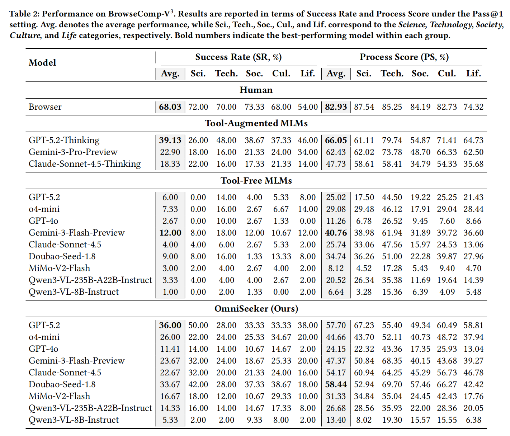
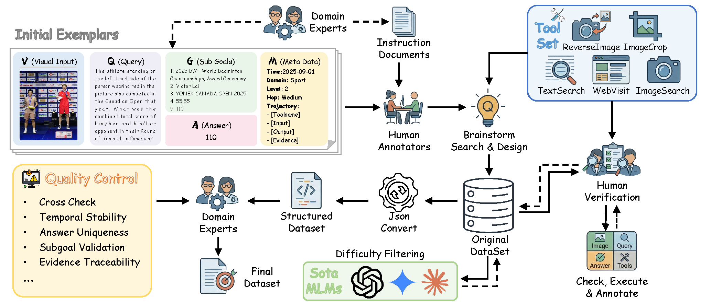
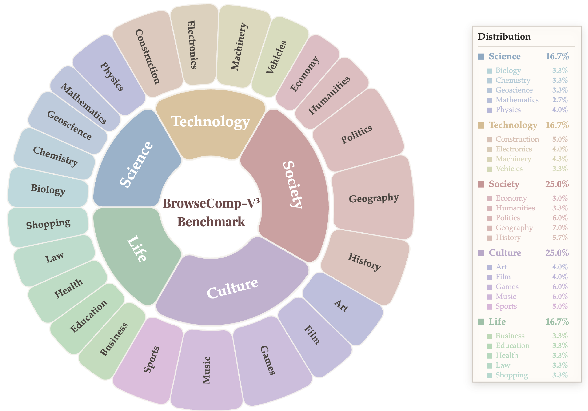
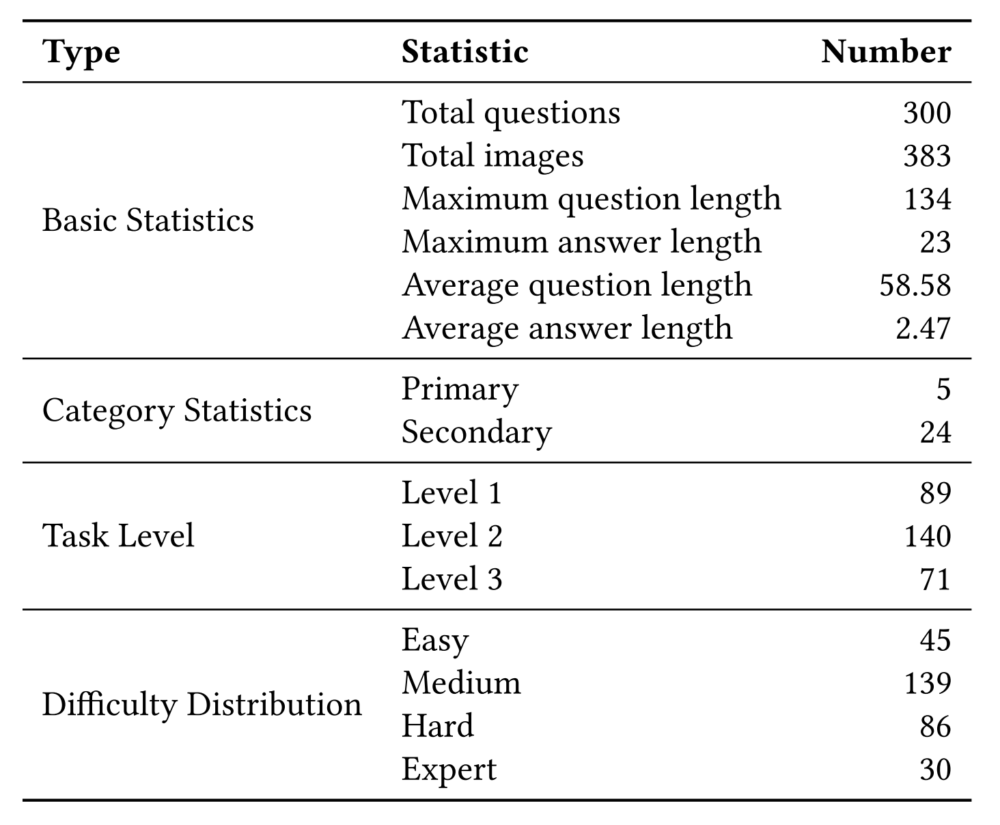

# BrowseComp-V³: A Visual, Vertical, and Verifiable Benchmark for Multimodal Browsing Agents

Multimodal large language models (MLLMs), leveraging their increasingly advancing autonomous planning and tool use capabilities, are evolving into intelligent agents capable of performing web browsing for multimodal deep search. However, existing benchmarks remain limited in terms of task complexity, information searchability, and evaluation dimensions, thereby hindering comprehensive assessments of multimodal browsing agents' deep search capabilities in open-world environments. To bridge these gaps, we present **BrowseComp-V³**, a novel benchmark comprising 300 meticulously hand-crafted, challenging questions across diverse domains. By emphasizing deep, multi-level, and cross-modal multi-hop reasoning, we ensure that these tasks necessitate the use of web browsing tools and cannot be resolved solely through the model's parametric knowledge. Moreover, we strictly enforce the public searchability of all supporting evidence and incorporate an expert-validated, subgoal-driven process evaluation mechanism, thereby enabling fine-grained characterization of search behaviors and systematic analysis of capability boundaries. Beyond the dataset, we provide **OmniSeeker**, a general multimodal browsing agent framework, and conduct a comprehensive evaluation on MLLMs. The results demonstrate that even state-of-the-art models, such as GPT-5.2, achieve only 36% accuracy. Further analysis reveals critical bottlenecks in existing models regarding multimodal information integration and fine-grained perception, highlighting a fundamental lack of native multimodal reasoning capabilities.

<p align="center">
  <a href="https://halcyon-zhang.github.io/BrowseComp-V3/"></a>
       
  <a href="https://huggingface.co/datasets/Halcyon-Zhang/BrowseComp-V3"></a>
       
  <a href="https://github.com/Halcyon-Zhang/BrowseComp-V3"></a>
</p>

---

## 📊 Results

### Main result

<p align="center">
  
</p>

### Data construction & dataset statistics

<p align="center">
  <br/>
  Data construction pipeline of BrowseComp-V³.
</p>

<p align="center">
     
  <br/>
  Left: Domain distribution. Right: Dataset statistics.
</p>

For experiment analysis (fine-grained analysis, scaling, failure modes, etc.), see the [project page](https://halcyon-zhang.github.io/BrowseComp-V3/).

---

## 1. 📥 Download and decrypt data

The dataset includes encrypted question-answer pairs to protect intellectual property while allowing community review. You must decrypt them before running inference.

### 🔐 Overview

- **Algorithm:** AES-256-GCM (Galois/Counter Mode)
- **Key derivation:** SHA-256 hash of the passphrase
- **IV/tag:** 16-byte base64-encoded

### 🔑 Passphrase (key)

Use this passphrase to derive the decryption key:

```
A_Visual_Vertical_Verifiable_Benchmark_for_Multimodal_Browsing_Agents
```

### 📋 Data format

The canonical format is **`train.jsonl`** (one JSON object per line). Each record has `id`, `category`, `sub_category`, `image`, `image_paths` (JSON string), `encrypted_question`, `encrypted_answer`, `metadata` (JSON string), `sub_goals` (JSON string). Images are under `data/images/` in the dataset.

### 📦 Requirements

```bash
pip install -r requirements.txt
# or: pip install cryptography
```

### ⬇️ Download

Download the dataset from [Hugging Face](https://huggingface.co/datasets/Halcyon-Zhang/BrowseComp-V3) (e.g. clone the repo or use `datasets.load_dataset("Halcyon-Zhang/BrowseComp-V3")`). Place `train.jsonl` and the `data/images/` directory in your working directory (e.g. `data/`).

### 🔓 Decrypt: full dataset to one JSON file

```bash
python scripts/decryption_script.py \
  --input data/train.jsonl \
  --key "A_Visual_Vertical_Verifiable_Benchmark_for_Multimodal_Browsing_Agents" \
  --output decrypted_bcv3.json
```

Use `--keep-encrypted` to keep encrypted fields in the output (default: remove them).

### 📂 Decrypt: batch to per-sample JSON files (recommended for rollout)

```bash
echo "A_Visual_Vertical_Verifiable_Benchmark_for_Multimodal_Browsing_Agents" > key.txt

python scripts/decrypt_batch.py \
  --input data/train.jsonl \
  --key-file key.txt \
  --output-dir decrypted_samples/
```

Output: one JSON file per sample under `decrypted_samples/` (e.g. `001_Culture_Art_L3_p2_t2_m0_r2_w0_c0_g5.json`). Run from the **repository root**; the script resolves `scripts/encryption_utils.py` automatically.

**Copy images into the output dir** so that relative paths like `data/images/xxx.jpg` in the JSON resolve when running rollout:

```bash
python scripts/decrypt_batch.py \
  --input data/train.jsonl \
  --key-file key.txt \
  --output-dir decrypted_samples/ \
  --copy-images /path/to/dataset_root
```

Use `--copy-images` with the **directory that contains** the `data/` folder (e.g. your Hugging Face repo root). Referenced images are copied to `output-dir/data/images/`. Optional: `--limit N` decrypts only the first N samples (for quick tests).

### 🐍 Python API (optional)

```python
import sys
sys.path.insert(0, "scripts")
from encryption_utils import derive_key, decrypt_text

key = derive_key("A_Visual_Vertical_Verifiable_Benchmark_for_Multimodal_Browsing_Agents")
# encrypted_dict = {"iv": "...", "ciphertext": "...", "tag": "..."}
# plaintext = decrypt_text(encrypted_dict, key)
```

### ⚠️ Troubleshooting

- **Decryption failed / integrity error:** Use the exact passphrase (case-sensitive); ensure iv/ciphertext/tag are valid.
- **Unrecognized format:** Scripts skip lines without encrypted fields; confirm input is `train.jsonl`-style.
- **File not found:** Use paths relative to the repo root or absolute paths; for batch mode the key file must exist.

---

## 2. 🚀 Run inference

After decrypting to per-sample JSONs (e.g. `decrypted_samples/`), run the rollout: one VLM call per sample (question + images).

```bash
export OPENAI_API_KEY="your-key"
# optional: export OPENAI_API_BASE="https://..."

python run_rollout.py \
  --data_dir decrypted_samples/ \
  --output_dir results \
  --model_name gpt-4o
```

- **`--data_root`:** Root for resolving relative image paths (default: same as `--data_dir`). If your decrypted JSONs reference `data/images/xxx.jpg`, set `--data_root` to the directory that contains `data/` (e.g. your `decrypted_samples/` dir if you used `--copy-images`).
- **`--dry_run`:** Build messages and verify that images are encoded (no API call); prints content structure for the first sample.
- Output is written under `results/<model_name>/<domain>/<id>.json`. These JSONs are the input for the evaluation script.

For **tool-aided rollout** and **OmniSeeker**, see the [project page](https://halcyon-zhang.github.io/BrowseComp-V3/) and [GitHub](https://github.com/Halcyon-Zhang/BrowseComp-V3).

---

## 3. ✅ Run evaluation

Evaluate the rollout results (final answer correctness + process score) using an LLM judge:

```bash
python eval_rollout_results.py \
  --input_dir results/gpt-4o \
  --judge_model gpt-4o
```

- **OPENAI_API_KEY** (and optionally **OPENAI_API_BASE**) must be set (or in a `.env` file in the current working directory).
- Output: `eval_<model>.jsonl` in the same directory as `input_dir` (or use `--output_path` to override).

---

## 4. 📈 Summarize results

Aggregate scores by domain, level, and difficulty:

```bash
python summarize_eval_scores.py results/gpt-4o/eval_gpt-4o.jsonl
```

Prints per-model buckets (domain d1, domain d1/d2, level, difficulty) with counts and average final/process scores.

---

## 5. 📦 Requirements

Install from the repo root:

```bash
pip install -r requirements.txt
```

Included: `openai`, `cryptography`, `python-dotenv`, `requests`. The rollout script uses the OpenAI-compatible API and standard library for image handling (no Pillow required for basic usage).

---

## 6. 📄 Citation

```bibtex
@article{zhang2026browsecompv3,
  title   = {BrowseComp-$V^3$: A Visual, Vertical, and Verifiable Benchmark for Multimodal Browsing Agents},
  author  = {Huanyao Zhang and Jiepeng Zhou and Bo Li and Bowen Zhou and Yanzhe Dan and Haishan Lu and Zhiyong Cao and Jiaoyang Chen and Yuqian Han and Zinan Sheng and Zhengwei Tao and Hao Liang and Jialong Wu and Yang Shi and Yuanpeng He and Jiaye Lin and Qintong Zhang and Guochen Yan and Runhao Zhao and Zhengpin Li and Xiaohan Yu and Lang Mei and Chong Chen and Wentao Zhang and Bin Cui},
  journal = {arXiv preprint arXiv:2602.12876},
  year    = {2026}
}
```

---

## 📜 License

CC BY 4.0. See the [dataset card](https://huggingface.co/datasets/Halcyon-Zhang/BrowseComp-V3) for details.
