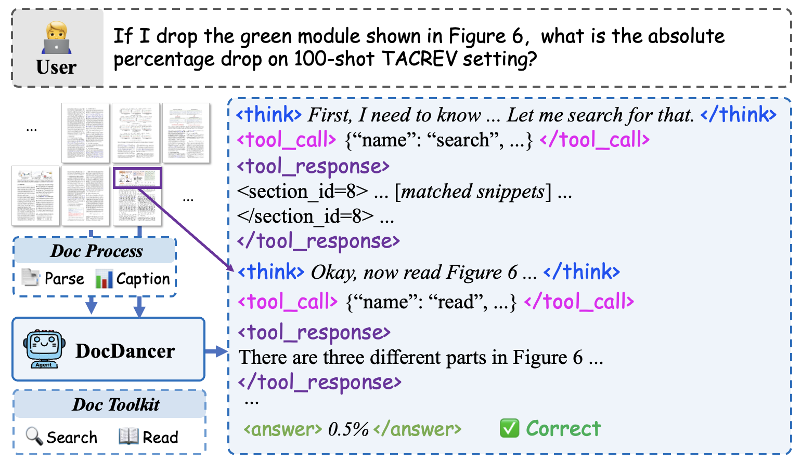
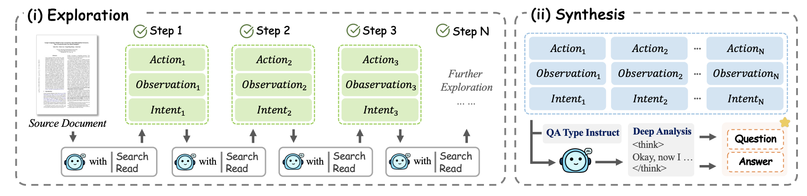
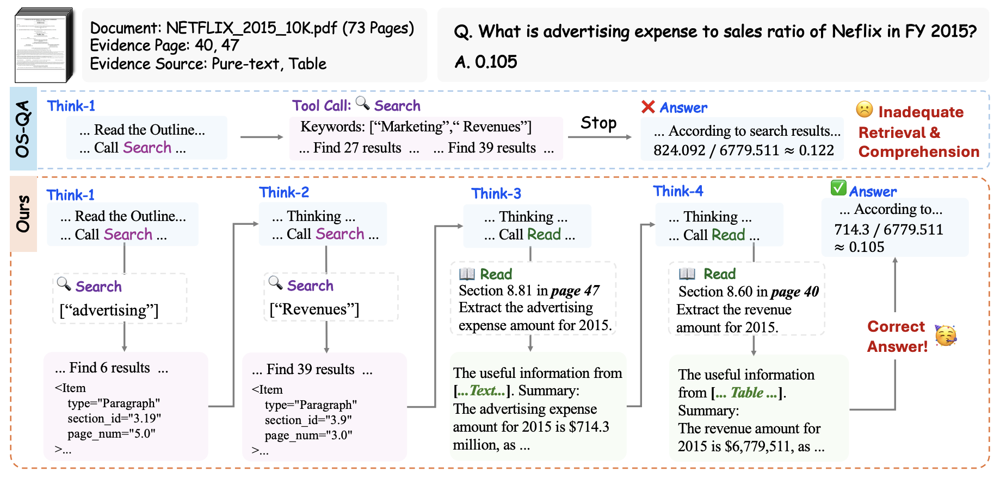
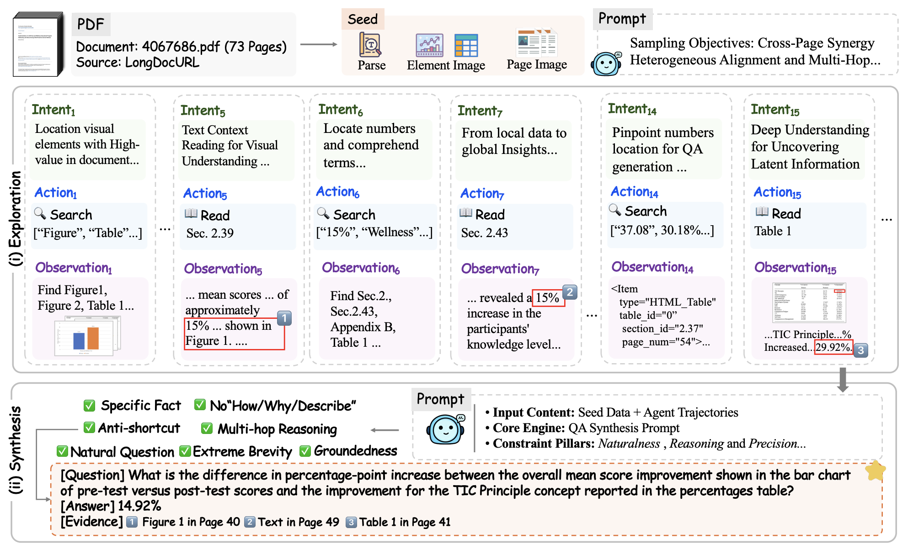

<h1 align="center">
  DocDancer: Towards Agentic Document-Grounded Information Seeking
</h1>

<p align="center">
  <a href="https://arxiv.org/abs/2601.05163"><b>📜 Paper</b></a> |
  <a href="https://huggingface.co/OpenDCAI/AgentFlow-Qwen3-30B-A3B-Think-DocDancer"><b>🤗 Huggingface Model</b></a> |
  <a href="https://huggingface.co/datasets/OpenDCAI/AgentFlow-DocDancer"><b>🤗 Huggingface Datasets</b></a>
</p>

**DocDancer** is an efficient agent framework for complex long-document question answering via tool-driven information seeking. 
This repository provides the document preprocessing pipeline, including PDF processing and structured inputs for benchmarks and synthetic data.

- [🔍 Introduction](#introduction)
- [🌟 Key Features](#key-features)
- [📦 Datasets](#datasets)
- [🛠️ Usage](#usage)
  - [Installation](#installation)
  - [PDF Preprocess](#pdf-preprocess)
- [🔥 Performance](#performance)
- [🙏 Acknowledgements](#acknowledgements)
- [📄 Citation](#citation)
- [⚖️ License](#license)

---

## 🔍 Introduction

Long-document DocQA requires iterative exploration, structured reasoning, and multimodal grounding. Existing OCR and RAG pipelines often struggle with long context and complex layouts, while most agent systems rely on static prompt engineering without learnable behaviors.

<p align="center">
  <br>
  <em>Figure 1: Overview of the DocDancer framework.</em>
</p>


**DocDancer** formulates DocQA as an **agentic information-seeking process**, where the model actively interacts with documents via tools. To enable end-to-end training, we introduce an **Exploration-then-Synthesis** data pipeline that generates high-quality, multi-step, document-grounded QA trajectories.

We instantiate DocDancer on **Qwen3-4B** and **Qwen3-30B-A3B** backbones, achieving strong results on **MMLongBench-Doc** and **DocBench**.

<p align="center">
  <br>
  <em>Figure 2: Overview of the Exploration-then-Synthesis framework.</em>
</p>

---

## 🌟 Key Features

- **Tool-Driven Agent Framework**: Minimal two-tool design (Search + Read) for global retrieval and local multimodal comprehension.
- **Improved Document Parsing**: High-fidelity hierarchical outlines with enhanced layout and visual grounding.
- **Exploration-then-Synthesis Pipeline**: Generates high-quality multi-hop QA trajectories for training agentic behaviors.
- **Data Efficiency**: Achieves SOTA or competitive results using only 5K training trajectories.

---

## 📦 Datasets

We release the following datasets on Hugging Face:

1.  **[5K Synthetic Training Data](https://huggingface.co/datasets/OpenDCAI/AgentFlow-DocDancer)**: Includes 5K Exploration-then-Synthesis trajectories.
2.  **[Benchmark Inputs](https://huggingface.co/datasets/OpenDCAI/AgentFlow-DocDancer-benchmark)**: Original PDFs, preprocessed structured inputs, and QA pairs for **MMLongDoc-Bench** and **DocBench**.
3.  **[Document Corpus](https://huggingface.co/datasets/OpenDCAI/AgentFlow-DocDancer-DocData)**: Curated documents from LongDocURL, MMDocRAG, DUDE, and CUAD.

---


# 🛠️ Usage

The agent workflow of DocDancer and the Exploration-then-Synthesis data pipeline are implemented within the **AgentFlow** framework. For comprehensive agent instructions, please refer to the [AgentFlow README](../../README.md).

This section specifically focuses on the **PDF Preprocessing Pipeline**.

---

## ⚙️ Installation

The PDF preprocessing pipeline is built upon [mineru-vl-utils](https://github.com/opendatalab/mineru-vl-utils). Please refer to the official documentation for detailed environment setup, including vLLM installation and model deployment.

**Basic dependencies:**
```bash
pip install 'mineru-vl-utils[vllm]' pdf2image Pillow PyMuPDF pandas numpy openai tqdm
```

## PDF Preprocess

The preprocessing pipeline consists of three steps:
1. **PDF Extraction** (`1_run_pdf_extract.py`): Extracts OCR results using MinerU VLM with vLLM engine
2. **Data Processing** (`2_process_extracted_data.py`): Processes OCR results, crops images/tables, generates image descriptions, and outputs structured data
3. **Outline Generation** (`3_get_outline_and_root.py`): Generates document outline and full content XML files

### Quick Start

**Method 1: Using Bash Script (Recommended)**
```bash
cd PDF_preprocess
chmod +x run_pipeline.sh
./run_pipeline.sh
```

**Method 2: Manual Step-by-Step Execution**
```bash
# Step 1: PDF Extraction
python 1_run_pdf_extract.py \
    --input_dir test_PDF \
    --output_dir output/ocr_json \
    --model_path opendatalab/MinerU2.5-2509-1.2B

# Step 2: Data Processing
python 2_process_extracted_data.py \
    --input_root output/ocr_json \
    --output_root output/processed \
    --pdf_root test_PDF \
    --max_workers 4

# Step 3: Outline Generation
python 3_get_outline_and_root.py output/processed
```

Place your PDF files in `test_PDF/` directory before running.

### Configuration

**Environment Variables:**
```bash
# Set model path
export MODEL_PATH="opendatalab/MinerU2.5-2509-1.2B"

# Set maximum worker processes
export MAX_WORKERS=4

# Run pipeline
./run_pipeline.sh
```

### Script Parameters

#### 1_run_pdf_extract.py
- `--input_dir`: Directory containing PDF files (required)
- `--output_dir`: Output directory for OCR JSON files (required)
- `--model_path`: MinerU model repo or checkpoint path (optional, default: `opendatalab/MinerU2.5-2509-1.2B`)

#### 2_process_extracted_data.py
- `--input_root`: Input directory containing OCR JSON files (required)
- `--output_root`: Output directory for processed structured data (required)
- `--pdf_root`: Source PDF files directory (required)
- `--max_workers`: Maximum number of parallel workers (optional, default: 4)

#### 3_get_outline_and_root.py
- `prepress_root_path`: Root directory of processed data (positional argument, required)

### Output Structure

After processing, the output structure is as follows:

```
output/
├── ocr_json/                    # Step 1 output
│   ├── PDF1_ocr.json
│   └── PDF2_ocr.json
│
└── processed/                   # Step 2 and 3 output
    ├── PDF1/
    │   ├── data.pkl            # Structured data (DataFrame)
    │   ├── PDF1.json           # JSON format data
    │   ├── outline.xml         # Document outline (as the seed content)
    │   ├── all_content.xml     # Full content
    │   ├── figures/            # Extracted images
    │   │   ├── image_0.png
    │   │   └── ...
    │   ├── tables/             # Extracted tables
    │   │   ├── table_0.png
    │   │   └── ...
    │   └── page_images/        # Page images
    │       ├── page_0000.png
    │       └── ...
    └── PDF2/
        └── ...
```


## Evaluation
We provide the LasJ (LLM-as-Judge) prompt used for MMLongDocBench evaluation: [assets/LasJ_prompt_for_MMLongDocBench.md](./eval/LasJ_prompt_for_MMLongDocBench.md)
This setting improves robustness to answer formatting variations and mitigates extraction noise.


# 🔥 Performance

## Overall Performance on Long Document Q&A Benchmarks

| Method Category | Method | Model | MMLongBench-Doc Acc | MMLongBench-Doc F1 | MMLongBench-Doc LasJ | DocBench LasJ |
|-----------------|--------|--------|---------------------|--------------------|----------------------|---------------|
| **VLM Baseline** | Naive VL (Ma et al., 2024) | GPT-4o | 42.8 | 44.9 | - | 63.1 |
|  | Naive VL (Zhu et al., 2025) | Gemini-2.5-Pro | - | - | 58.1 | - |
| **OCR-based Baseline** | fitz | GPT-4 | - | - | - | 67.9 |
|  | Tesseract (Smith, 2007) | GPT-4o | 30.1 | 30.5 | - | - |
|  | Tesseract (Smith, 2007) | Gemini-2.0-Flash | 39.6 | 37.2 | - | - |
| **RAG-based Baseline** | VisRAG (Yu et al., 2024) | GPT-4o | 29.0 | 27.8 | - | - |
|  | Colpali (Faysse et al., 2024) | GPT-4o | 32.2 | 30.8 | - | - |
|  | M3DocRAG w/ ColPali (Cho et al., 2025) | Qwen2-VL-7B | 31.4 | 36.5 | - | - |
|  | RAGAnything (Guo et al., 2025b) | GPT-4o-mini | 42.8 | - | - | 63.4 |
| **Prompt-based Agent** | Doc-React (Wu et al., 2025c) | GPT-4o | 38.1 | 38.3 | - | - |
|  | MDocAgent (Han et al., 2025) | GPT-4o | 42.0 | - | - | - |
|  | MACT (Yu et al., 2025) | MiMo-VL-7B | 47.4 | - | - | - |
|  | SimpleDoc (Jain et al., 2025) | Claude-4-Sonnet | - | - | 58.6 | - |
|  | SimpleDoc (Jain et al., 2025) | Gemini-2.5-Pro | - | - | 56.6 | - |
|  | DocLens (Zhu et al., 2025) | Claude-4-Sonnet | - | - | 63.3 | - |
|  | DocLens (Zhu et al., 2025) | Gemini-2.5-Pro | - | - | 67.6 | - |
|  | DocAgent (Sun et al., 2025a) | GPT-4o | 51.8 | 49.1 | - | 79.9 |
|  | DocAgent (Sun et al., 2025a) | Claude-3.5-Sonnet | 57.3 | 54.1 | - | - |
| **Ours** | DocDancer | GPT-4o | 52.3 | 50.8 | 59.2 | 73.5 |
|  | DocDancer | Gemini-2.5-Pro | 56.3 | 55.3 | 65.9 | 79.9 |
|  | DocDancer | GPT-5.2 | 57.0 | 56.8 | 67.6 | 85.5 |
|  | DocDancer | Qwen3-4B (ft) | 48.4 | 49.2 | 59.4 | 79.8 |
|  | DocDancer | Qwen3-30B-A3B (ft) | 54.4 | 53.9 | 65.3 | 81.2 |
| **Human Baseline** | - | - | 65.8 | 66.0 | - | 81.2 |

## Case Study

<p align="center">
  <br>
 <em>A case study of DocDancer on a QA in MMLongDoc-Bench.</em>
</p>


DocDancer performs multi-round evidence gathering across distant sections of a 73-page financial document to correctly compute an advertising-to-revenue ratio (0.105), while the OS-QA model fails due to shallow retrieval.

---

## Synthetic Data Effectiveness

<p align="center">
  <br>
  <em>A case study of the Exploration-then-Synthesis framework generating a multi-hop, cross-document,
cross-modal numerical reasoning QA pair</em>
</p>

Models trained on synthesized QA data significantly outperform those trained on human-annotated QA pairs (OS-QA), validating the Exploration-then-Synthesis pipeline.

# Acknowledgements
We thank the contributors of [MMLongDoc-Bench](https://github.com/mayubo2333/MMLongBench-Doc), [DocBench](https://github.com/Anni-Zou/DocBench), [LongDocURL](https://github.com/dengc2023/LongDocURL), [MMDocRAG](https://mmdocrag.github.io/MMDocRAG/), [CUAD](https://github.com/TheAtticusProject/cuad), and [DUDE](https://github.com/duchallenge-team/dude) for providing high-quality document resources and benchmarks.


# Citation
```
@article{zhang2026docdancer,
  title={DocDancer: Towards Agentic Document-Grounded Information Seeking},
  author={Zhang, Qintong and Lv, Xinjie and Wu, Jialong and Li, Baixuan and Tao, Zhengwei and Yan, Guochen and Zhang, Huanyao and Wang, Bin and Xu, Jiahao and Mi, Haitao and others},
  journal={arXiv preprint arXiv:2601.05163},
  year={2026}
}
```

# License
DocDancer is released under `CC BY-NC-SA 4.0` license. By downloading our dataset from our website or other sources, the user agrees to adhere to the terms of `CC BY-NC-SA 4.0` and licenses of the source datasets
